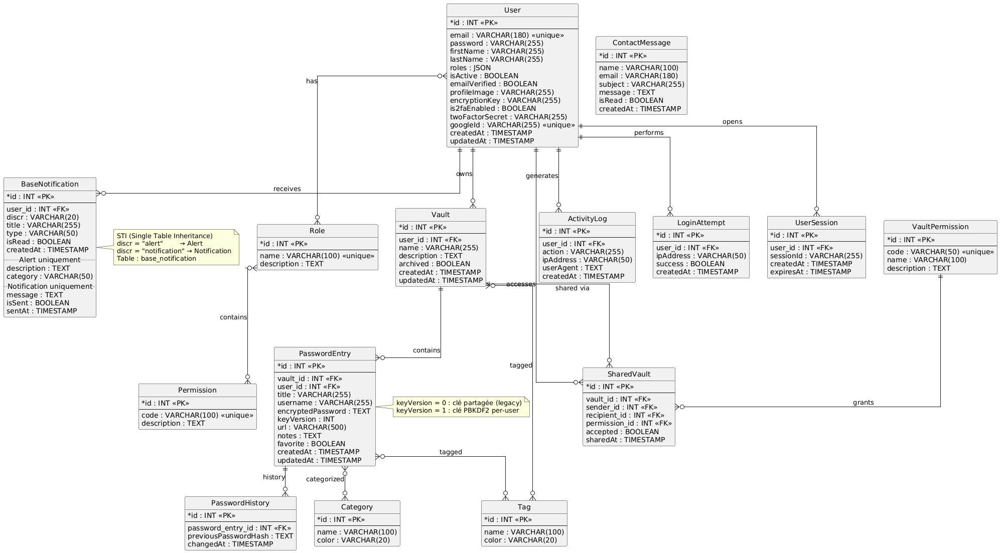

# SecureVault — Gestionnaire de mots de passe sécurisé

Application web de gestion de mots de passe développée avec **Symfony 7**, **PostgreSQL 16** et **FrankenPHP**. Interface responsive, chiffrement AES-256-GCM per-user (PBKDF2), authentification Google OAuth2, 2FA, panel admin custom et API REST JWT.

**Documentation :**
[Cahier des charges](docs/cahier_de_charge.md) · [Schéma BDD](docs/database-schema.md) · [Guide de test](docs/TESTING.md) · [Scénarios de test](docs/TEST_SCENARIOS.md)



---

## Fonctionnalités

- Gestion de coffres-forts chiffrés (AES-256-GCM)
- **Chiffrement per-user** — clé dérivée via PBKDF2 (100 000 itérations) à la connexion, stockée en session uniquement. L'admin ne peut pas lire vos mots de passe.
- **Héritage d'entités Doctrine** (STI) — `Alert` et `Notification` héritent de `BaseNotification`
- **Vérification fuite de données** — API HaveIBeenPwned (k-anonymity via `HttpClient`) + commande CLI `securevault:check-leaked-passwords`
- Générateur de mots de passe intégré (home + dashboard)
- Recherche dans les coffres (titre, identifiant, URL, nom du coffre)
- Partage de coffres avec permissions granulaires (READ / WRITE / ADMIN)
- Authentification par e-mail + mot de passe
- **Authentification Google OAuth2** (connexion et inscription)
- Vérification d'e-mail obligatoire à l'inscription
- Double authentification par e-mail (2FA, optionnelle par compte)
- Audit de sécurité (score, mots de passe faibles / anciens)
- Journal d'activité, alertes de sécurité, notifications
- Suivi des tentatives de connexion
- **Page de contact** (`/contact`) — formulaire public avec stockage en base et e-mails automatiques (confirmation + notification admin)
- **Panel admin custom** (`/admin`) au design cohérent avec le site
- EasyAdmin avancé (`/easyadmin`) pour la gestion technique (CRUD complet)
- **API REST v1 (JWT)** — sérialisée via Symfony Serializer avec groupes de normalisation (`#[Groups]`)
- **Filtres Twig personnalisés** — `time_ago`, `password_strength`
- **Fixtures réalistes** (FakerPHP) — 10 users, 15 coffres, ~48 mots de passe, ~60 alertes/notifications
- **Pipeline CI complet** (GitHub Actions) — tests unitaires, fonctionnels, E2E, lint Twig/YAML, PHPStan niveau 5
- Interface **100% gratuite** — aucun abonnement requis
- Design responsive / mobile-first (Tailwind CSS, Manrope, GSAP)

---

## Prérequis

- [Docker](https://docs.docker.com/get-docker/)
- [Docker Compose](https://docs.docker.com/compose/install/)
- [Make](https://www.gnu.org/software/make/)

---

## Lancer l'application en local (Docker)

### 1. Démarrer les conteneurs

```bash
make up
```

| Service    | Rôle                                    | Accès                   |
| :--------- | :-------------------------------------- | :---------------------- |
| `app`      | Application Symfony (FrankenPHP)        | http://localhost:8080   |
| `database` | PostgreSQL 16                           | `localhost:5432`        |
| `mailer`   | Mailpit — capture les e-mails sortants  | http://localhost:8025   |

### 2. Installer les dépendances PHP

```bash
make composer-install
```

### 3. Configurer les variables d'environnement

Copiez `.env.example` en `.env.local` et remplissez les valeurs :

```bash
cp .env.example .env.local
```

Variables minimales à définir :

```dotenv
VAULT_ENCRYPTION_KEY=<openssl rand -base64 32>
JWT_PASSPHRASE=votre-passphrase
Google_Client_ID=votre-client-id
Google_Client_Secret=votre-client-secret
MAILER_DSN=smtp://mailer:1025
```

### 4. Préparer la base de données

```bash
make migrate
```

Pour repartir d'une base vierge avec données de démonstration :

```bash
make db-setup
```

Cette commande charge les fixtures Faker : 10 utilisateurs, 15 coffres, ~48 mots de passe, ~60 alertes/notifications.

### Comptes de test (après `make db-setup`)

| Email | Mot de passe | Rôle |
| :---- | :----------- | :--- |
| `admin@securevault.local` | `Admin1234!` | `ROLE_ADMIN` — panel custom `/admin` + back-office `/easyadmin` |
| `alice@securevault.local` | `User1234!`  | `ROLE_USER` |
| `bob@securevault.local`   | `User1234!`  | `ROLE_USER` |
| `carol@securevault.local` | `User1234!`  | `ROLE_USER` |

> Les autres utilisateurs générés aléatoirement par Faker ont tous le mot de passe `User1234!`.

### 5. Générer les clés JWT

```bash
make jwt-keys
```

Les clés RSA sont créées dans `config/jwt/` (gitignorées). À relancer uniquement si vous supprimez le volume.

L'application est accessible sur **http://localhost:8080**.

---

## Variables d'environnement

| Variable               | Obligatoire | Description                                                               |
| :--------------------- | :---------: | :------------------------------------------------------------------------ |
| `VAULT_ENCRYPTION_KEY` | Oui         | Salt de base pour fallback AES (utilisateurs non-PBKDF2)                 |
| `MAILER_DSN`           | Oui         | DSN SMTP (`smtp://mailer:1025` via Mailpit en dev)                        |
| `JWT_SECRET_KEY`       | Oui         | Chemin vers la clé privée RSA (géré via volume Docker)                   |
| `JWT_PUBLIC_KEY`       | Oui         | Chemin vers la clé publique RSA (géré via volume Docker)                 |
| `JWT_PASSPHRASE`       | Oui         | Passphrase des clés JWT                                                   |
| `Google_Client_ID`     | Oui         | Client ID OAuth2 Google (Google Cloud Console)                            |
| `Google_Client_Secret` | Oui         | Client Secret OAuth2 Google                                               |
| `DATABASE_URL`         | Oui         | URL de connexion PostgreSQL                                               |

### Générer `VAULT_ENCRYPTION_KEY`

```bash
openssl rand -base64 32
```

---

## Référence des commandes Makefile

### Docker & infrastructure

| Commande            | Description                                    |
| :------------------ | :--------------------------------------------- |
| `make up`           | Démarre les conteneurs en arrière-plan          |
| `make down`         | Arrête et supprime les conteneurs               |
| `make restart`      | Redémarre tous les conteneurs                  |
| `make build`        | Reconstruit les images Docker (sans cache)     |
| `make logs`         | Affiche les logs de tous les conteneurs        |
| `make ps`           | Liste les conteneurs en cours d'exécution      |
| `make shell`        | Ouvre un shell dans le conteneur `app`         |
| `make db-shell`     | Ouvre un shell psql dans `database`            |

### Application

| Commande                 | Description                                          |
| :----------------------- | :--------------------------------------------------- |
| `make composer-install`  | Installe les dépendances Composer                    |
| `make migrate`           | Exécute les migrations Doctrine                      |
| `make db-setup`          | Recrée la BDD, migre et charge les fixtures          |
| `make fixtures`          | Charge les fixtures sans purger                      |
| `make jwt-keys`          | Génère les clés RSA pour JWT                         |
| `make cc`                | Vide le cache Symfony                                |
| `make log_tail`          | Suit les logs Symfony en temps réel                  |

### Tests

| Commande               | Description                                         |
| :--------------------- | :-------------------------------------------------- |
| `make test`            | Lance tous les tests                                |
| `make test-unit`       | Tests unitaires                                     |
| `make test-functional` | Tests fonctionnels (WebTestCase)                    |
| `make test-e2e`        | Tests E2E (navigateur headless Panther)             |

---

## Sécurité — chiffrement per-user

À la connexion, `LoginSuccessSubscriber` :

1. Récupère le mot de passe en clair depuis le formulaire
2. Dérive une clé 256 bits via `PBKDF2(SHA-256, mot_de_passe, salt_user, 100 000 itérations)`
3. Stocke la clé **en session uniquement** (jamais en base)
4. Migre automatiquement toutes les entrées `keyVersion=0` (ancienne clé partagée) vers `keyVersion=1`

**Résultat :** sans le mot de passe de l'utilisateur, personne — y compris l'admin — ne peut déchiffrer les mots de passe stockés.

Les utilisateurs Google OAuth2 continuent d'utiliser la clé partagée (`keyVersion=0`) car aucun mot de passe en clair n'est disponible à la connexion.

---

## Authentification Google OAuth2

### Configuration Google Cloud Console

1. Créer un projet sur [console.cloud.google.com](https://console.cloud.google.com)
2. Activer l'API **Google Identity** (OAuth 2.0)
3. Créer un Client OAuth → Type : **Application Web**
4. Ajouter les URIs de redirection autorisés :
   - Dev : `http://localhost:8080/connect/google/callback`
   - Prod : `https://votre-domaine.com/connect/google/callback`
5. Copier `Client ID` et `Client Secret` dans `.env.local`

### Comportement

| Situation                              | Résultat                                                              |
| :------------------------------------- | :-------------------------------------------------------------------- |
| Nouveau compte Google                  | Compte créé automatiquement + connexion + flash "Bienvenue"           |
| Email existant sans Google             | Liaison automatique du compte + connexion + flash informatif          |
| Email déjà lié à Google                | Connexion directe                                                     |
| Clic "S'inscrire" avec compte existant | Connexion automatique + flash "Vous avez déjà un compte"             |

Les utilisateurs Google **ne passent pas par la 2FA** (identité déjà prouvée par Google).

---

## Interface web

### URLs principales

| Page                       | URL                          | Accès                |
| :------------------------- | :--------------------------- | :------------------- |
| Accueil                    | `/`                          | Public               |
| Inscription                | `/register`                  | Public               |
| Connexion                  | `/login`                     | Public               |
| Connexion Google           | `/connect/google`            | Public               |
| Contact                    | `/contact`                   | Public               |
| Vérification 2FA           | `/2fa/verify`                | Après connexion      |
| Dashboard                  | `/dashboard`                 | Utilisateur connecté |
| Coffres                    | `/vaults`                    | Utilisateur connecté |
| Tous les mots de passe     | `/passwords`                 | Utilisateur connecté |
| Partages                   | `/shares`                    | Utilisateur connecté |
| Alertes de sécurité        | `/alerts`                    | Utilisateur connecté |
| Notifications              | `/notifications`             | Utilisateur connecté |
| Profil                     | `/profile`                   | Utilisateur connecté |
| Panel admin                | `/admin`                     | `ROLE_ADMIN`         |
| Admin — Utilisateurs       | `/admin/users`               | `ROLE_ADMIN`         |
| Admin — Messages contact   | `/admin/contacts`            | `ROLE_ADMIN`         |
| EasyAdmin avancé           | `/easyadmin`                 | `ROLE_ADMIN`         |

### Page de contact

`/contact` — formulaire public avec :
- Champs : nom, e-mail, sujet (select), message
- Protection CSRF
- Stockage du message en base de données (`contact_message`)
- E-mail de **notification** envoyé à l'admin (ReplyTo = expéditeur)
- E-mail de **confirmation** envoyé à l'expéditeur (délai de réponse 48h)

### Panel admin custom (`/admin`)

Interface au design cohérent avec le reste du site :
- Même sidebar teal, mêmes cartes blanches, même typographie Manrope
- **Dashboard** : stats (utilisateurs, coffres, connexions échouées 24h, messages non lus)
- **Utilisateurs** : liste avec rôles et statut de vérification
- **Messages de contact** : liste filtrable (tous / non lus / lus) avec badge compteur, lecture auto-marque comme lu, bouton "Répondre par e-mail"

### Générateur de mots de passe

Disponible sur la **page d'accueil** et dans le **dashboard** (colonne droite). Paramètres : longueur (8–40), majuscules, minuscules, chiffres, symboles. Raccourci ⌘K / Ctrl+K pour focaliser la recherche dans le dashboard.

### E-mails (Mailpit en dev)

Tous les e-mails sortants sont interceptés par Mailpit : http://localhost:8025

| E-mail                        | Déclencheur                               |
| :---------------------------- | :---------------------------------------- |
| Confirmation d'inscription    | Après inscription par e-mail              |
| Code 2FA                      | À chaque connexion avec 2FA activée       |
| Notification de contact       | À la réception d'un message via `/contact` |
| Confirmation de contact       | Envoyée à l'expéditeur du message         |

---

## API REST

Préfixe : `/api/v1/` — toutes les routes (sauf login) requièrent un token JWT :

```
Authorization: Bearer <token>
```

### Authentification

```
POST /api/v1/auth/login
{ "email": "user@example.com", "password": "..." }
→ { "token": "eyJ..." }
```

### Coffres

| Méthode  | Route                  | Description             |
| :------- | :--------------------- | :---------------------- |
| `GET`    | `/api/v1/vaults`       | Liste des coffres       |
| `GET`    | `/api/v1/vaults/{id}`  | Détail d'un coffre      |
| `POST`   | `/api/v1/vaults`       | Créer un coffre         |
| `PATCH`  | `/api/v1/vaults/{id}`  | Modifier un coffre      |
| `DELETE` | `/api/v1/vaults/{id}`  | Supprimer un coffre     |

### Mots de passe

| Méthode  | Route                                       | Description                         |
| :------- | :------------------------------------------ | :---------------------------------- |
| `GET`    | `/api/v1/vaults/{vaultId}/passwords`        | Liste des entrées                   |
| `GET`    | `/api/v1/vaults/{vaultId}/passwords/{id}`   | Détail avec mot de passe déchiffré  |
| `POST`   | `/api/v1/vaults/{vaultId}/passwords`        | Créer une entrée                    |
| `PATCH`  | `/api/v1/vaults/{vaultId}/passwords/{id}`   | Modifier une entrée                 |
| `DELETE` | `/api/v1/vaults/{vaultId}/passwords/{id}`   | Supprimer une entrée                |

---

## Structure du projet

```
src/
├── Controller/
│   ├── Api/                    # API REST stateless (JWT)
│   ├── Admin/                  # CustomAdminController + EasyAdmin CRUD
│   ├── ContactController.php   # Formulaire de contact public
│   ├── GoogleController.php    # OAuth2 Google (connect + callback)
│   └── *.php                   # Dashboard, Vault, Passwords, 2FA…
├── Entity/
│   ├── User.php                # encryptionKey = salt PBKDF2
│   ├── PasswordEntry.php       # keyVersion (0=shared, 1=per-user)
│   ├── ContactMessage.php      # Messages de contact public
│   └── …                       # Vault, SharedVault, Alert, Notification…
├── Security/
│   └── GoogleAuthenticator.php
├── Service/
│   ├── VaultKeyService.php     # Dérivation PBKDF2, stockage session
│   ├── EncryptionService.php   # AES-256-GCM
│   └── …                       # TwoFactor, Alert, Notification, ActivityLog…
├── EventSubscriber/
│   ├── LoginSuccessSubscriber.php  # Derive clé + migre keyVersion=0
│   ├── TwoFactorSubscriber.php
│   └── EmailVerificationSubscriber.php
└── Repository/
    ├── ContactMessageRepository.php  # countUnread()
    └── …
templates/
├── home/
│   ├── index.html.twig         # Page d'accueil
│   └── contact.html.twig       # Formulaire de contact
├── admin/
│   ├── layout.html.twig        # Sidebar admin custom (teal)
│   ├── dashboard.html.twig     # Stats + activité récente
│   ├── contacts/               # index.html.twig, show.html.twig
│   └── users/                  # index.html.twig
├── emails/
│   ├── base_email.html.twig
│   ├── contact_admin.html.twig       # Notification à l'admin
│   ├── contact_confirmation.html.twig # Confirmation à l'expéditeur
│   └── …
├── security/                   # Login, 2FA
├── registration/               # Inscription, vérification e-mail
└── dashboard/, vault/, passwords/, alerts/, …
migrations/
├── Version20260705000000.php   # Table contact_message
├── Version20260705000001.php   # Colonne key_version sur password_entry
└── …
config/
├── jwt/                        # Clés RSA (gitignorées)
└── packages/
    └── knpu_oauth2_client.yaml
```

**Infrastructure :**
- `Dockerfile` : FrankenPHP
- `compose.yaml` : `app` (8080), `database` (5432), `mailer` (8025)
- `Makefile` : raccourcis pour toutes les commandes courantes

---

## Configuration base de données

PostgreSQL 16 — utilisateur `app`, base `app`, port `5432`.

En développement Docker, la connexion se fait via le nom de service `database` (résolution interne Docker). Depuis l'hôte, utilisez `localhost:5432`.
